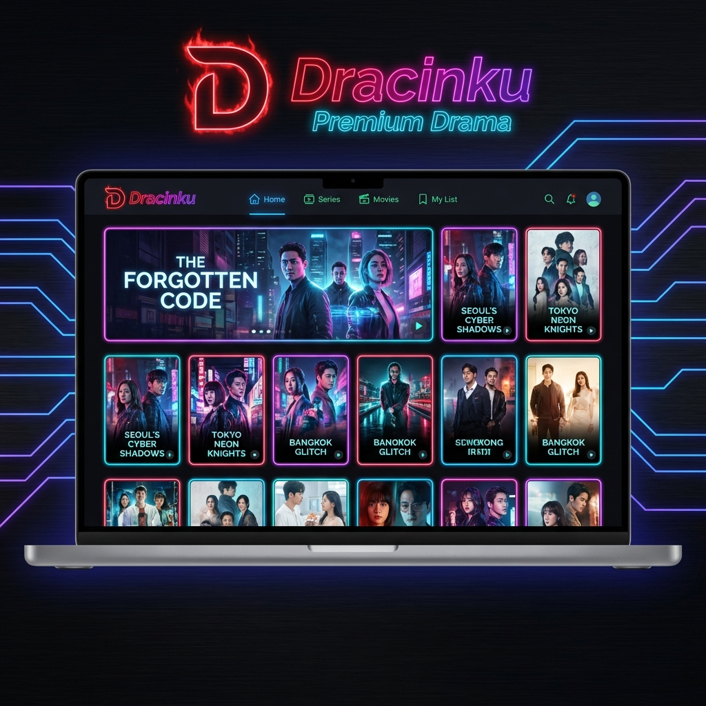

# DracinBox



DracinBox adalah platform streaming drama pendek premium modern. Dibangun dengan teknologi web terkini untuk performa maksimal dan pengalaman pengguna yang premium.

## Fitur Utama
-   **Nonton Gratis**: Akses ribuan drama pendek tanpa biaya.
-   **Tanpa Iklan**: Pengalaman menonton yang mulus tanpa gangguan.
-   **Multi-Platform**: Agregator konten dari berbagai sumber populer.
-   **Premium UI**: Desain modern dengan mode gelap, animasi, dan glassmorphism.

## Persyaratan Sistem
Sebelum memulai, pastikan komputer Anda sudah terinstall:
- [Node.js](https://nodejs.org/) (Versi 18 LTS atau 20 LTS disarankan)

## Panduan Instalasi (Localhost)

Ikuti langkah-langkah berikut untuk menjalankan project ini:

1.  Clone repository:
    ```bash
    git clone https://github.com/yutupremsatu/dracinbos.git
    cd dracinbos
    ```

2.  Install Dependencies:
    ```bash
    npm install
    ```

3.  Jalankan Development Server:
    ```bash
    npm run dev
    ```

4.  Buka browser dan kunjungi [http://localhost:3000](http://localhost:3000).

## Teknologi
-   Next.js 14
-   Tailwind CSS
-   Lucide Icons
-   HLS.js (Video Streaming)
